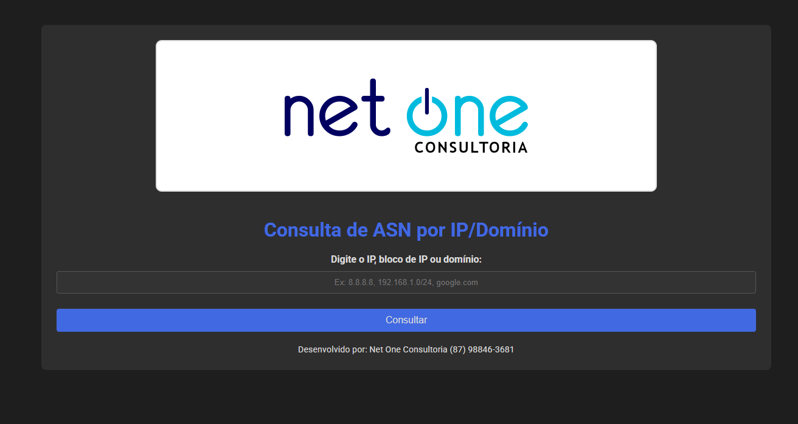
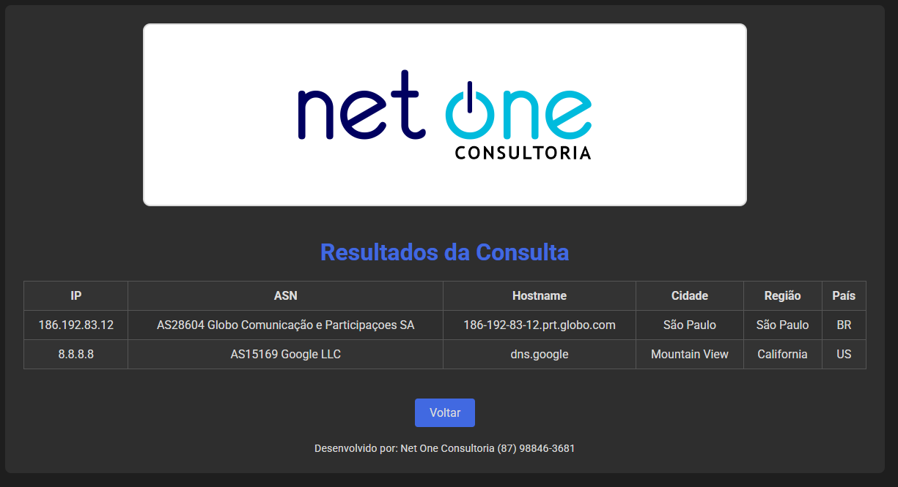

# 🔍 Consulta ASN

> **Uma aplicação web Flask para consulta de informações ASN (Autonomous System Number) através de IPs ou domínios**




[](https://www.python.org/)
[](https://flask.palletsprojects.com/)
[](https://www.docker.com/)
[](LICENSE)

## 📋 Sobre o Projeto

Esta aplicação permite consultar informações detalhadas de ASN (Autonomous System Number) através de endereços IP ou nomes de domínio. Desenvolvida com Flask e integrada à API do IPinfo, oferece uma interface web simples e intuitiva para análise de dados de rede.

### ✨ Funcionalidades

- 🌐 **Consulta por IP ou Domínio**: Suporte para ambos os formatos de entrada
- 🔄 **Resolução Automática**: Converte domínios para IP automaticamente
- 📊 **Informações Detalhadas**: ASN, ISP, localização geográfica e mais
- 🐳 **Docker Ready**: Containerização completa para fácil deployment
- 📱 **Interface Responsiva**: Design moderno e mobile-friendly

## 🚀 Tecnologias Utilizadas

- **Backend**: Python 3.8+ / Flask
- **API**: IPinfo.io
- **Frontend**: HTML5, CSS3, JavaScript
- **Containerização**: Docker & Docker Compose

## 📁 Estrutura do Projeto

```
consulta_asn/
├── app.py                 # Aplicação Flask principal
├── requirements.txt       # Dependências Python
├── Dockerfile            # Configuração Docker
├── docker-compose.yml    # Orquestração de containers
├── templates/            # Templates HTML
│   ├── index.html       # Página inicial
│   └── results.html     # Página de resultados
├── static/              # Arquivos estáticos
│   ├── styles.css      # Estilos CSS
│   └── logo.png        # Logo da aplicação
└── README.md           # Documentação

```

## ⚡ Início Rápido

### 📋 Pré-requisitos

- Python 3.8+ / Docker
- Conta no [IPinfo.io](https://ipinfo.io/) (para obter API key gratuita)

### 🔧 Instalação Local

1. **Clone o repositório**
   ```bash
   git clone https://github.com/renylson/consulta_asn.git
   cd consulta_asn
   ```

2. **Configure a API Key**
   ```python
   API_KEY = 'sua_api_key_aqui'
   ```

3. **Instale as dependências**
   ```bash
   pip install -r requirements.txt
   ```

4. **Execute a aplicação**
   ```bash
   python app.py
   ```

5. **Acesse no navegador**
   ```
   http://seuip:5000
   ```

### 🐳 Execução com Docker

1. **Clone e configure**
   ```bash
   git clone https://github.com/renylson/consulta_asn.git
   cd consulta_asn
   ```

2. **Construa e execute**
   ```bash
   docker build -t asn-lookup .
   docker run -d -p 5000:5000 --name asn-app asn-lookup
   ```

   **Ou usando Docker Compose:**
   ```bash
   docker-compose up -d
   ```

3. **Acesse a aplicação**
   ```
   http://localhost:5000
   ```

## 💡 Como Usar

1. **Acesse a aplicação** no seu navegador
2. **Digite IPs ou domínios** (separados por vírgula para múltiplas consultas)
3. **Clique em "Consultar"** para obter as informações
4. **Visualize os resultados** com dados detalhados de cada entrada

### 📝 Exemplos de Entrada

```
8.8.8.8
google.com
github.com, 1.1.1.1
192.168.1.1/24
```

## 🛠️ Comandos Docker Úteis

```bash
# Visualizar containers em execução
docker ps

# Verificar logs da aplicação
docker logs asn-app

# Parar a aplicação
docker stop asn-app

# Remover container
docker rm asn-app
```

## 📝 Licença

Este projeto está sob **todos os direitos reservados**. O código é disponibilizado para:
- ✅ **Visualização e aprendizado** para fins educacionais
- ✅ **Análise técnica** por recrutadores e colegas
- ✅ **Referência em portfolio** profissional

**⚠️ IMPORTANTE**: Qualquer uso comercial ou redistribuição requer autorização expressa.

Para permissões além da visualização, entre em contato através dos canais abaixo.
 
⚖️ **Licença**: [LICENSE](LICENSE) para termos legais completos

## 📧 Contato

**Renylson Marques**

- 📧 Email: [renylsonm@gmail.com](mailto:renylsonm@gmail.com)
- 💼 LinkedIn: [linkedin.com/in/renylsonmarques](https://linkedin.com/in/renylsonmarques)
- 🔗 GitHub: [github.com/renylson](https://github.com/renylson)

---

⭐ **Se este projeto foi útil para você, considere dar uma estrela!**
